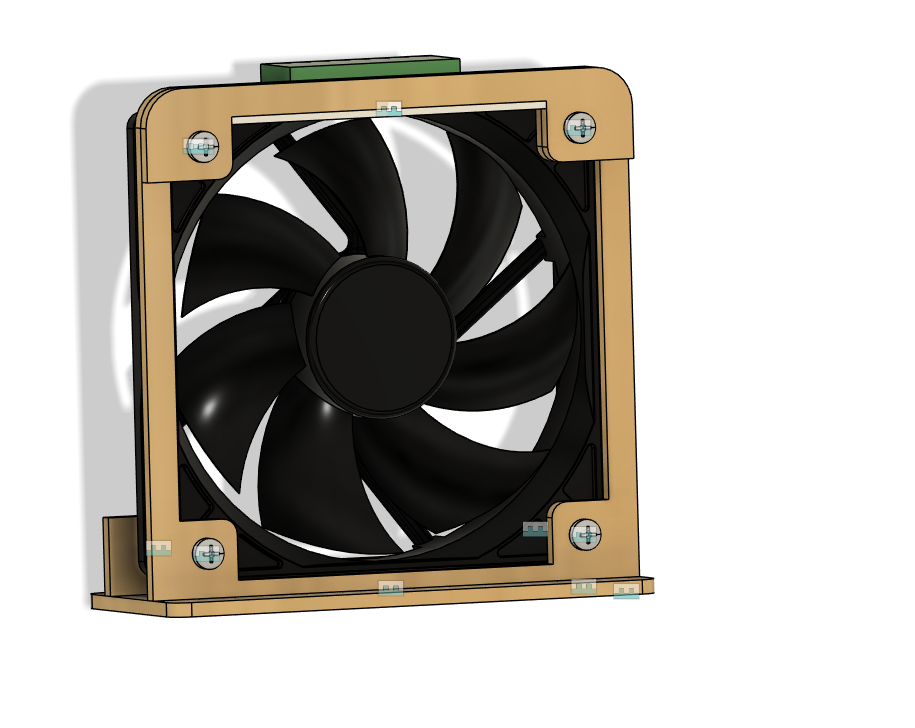
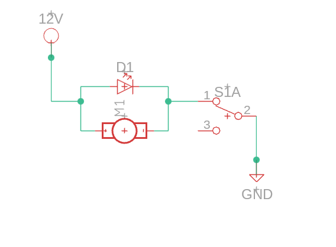
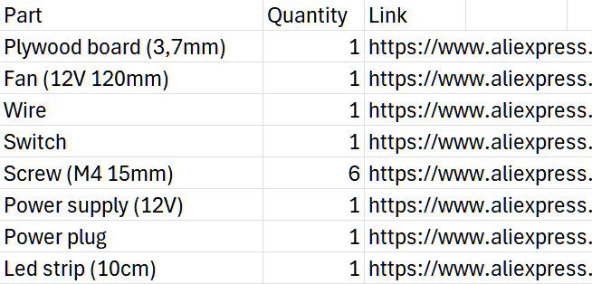

# Mini-fume-extractor
Small size fan, with acticated carbon filter possibility, that is able to suck fumes away from face when soldering and provide some lighting.

# Why?
I created this project as a cheaper alternative for actual fume extractors and as an upgrade to my soldering equipment.

# Project Overview
This fume extractor uses commonly found computer fan mounted in laser cut wooden case (that could be 3d printed as well). This way you have nice fume suction from your face and without a risk of fan falling over.

# Notes
* Since I cut this frame out of 3.7mm plywood, it might not be as easy to buy in every hardware shop. To counter this I created parameter called "HoldDepth", that can be accessed in .f3z file. Currently it is set to 3.7mm, but you can change to the thickness you need. 

* By changing "HoldDepth" sketches are changed as well. If you want you can regenarate DFX files for laser cutting too.

* Effective range of suction is about 15cm

# Gallery

  
  
  
  

# Wiring
Here is simple wiring circuit I created, when wiring this:

# BOM

