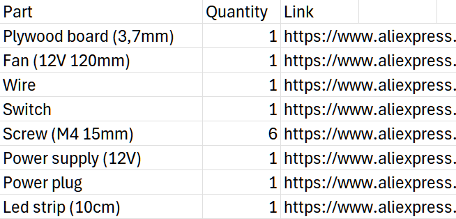

# Mini-fume-extractor
Small size fan, with filter, that is able to suck fumes away when soldering.

# Why?
I created this project as a cheaper alternative for actual fume extractors.

# Project Overview
This fume extractor uses commonly found computer fan mounted in laser cut wooden case (that could be 3d printed as well). This way you have nice fume suction.

* Effective range of suction is about 15cm

# Gallery

  
  
  
  

# Wiring
Here is simple wiring circuit I created, when wiring this:

# BOM

